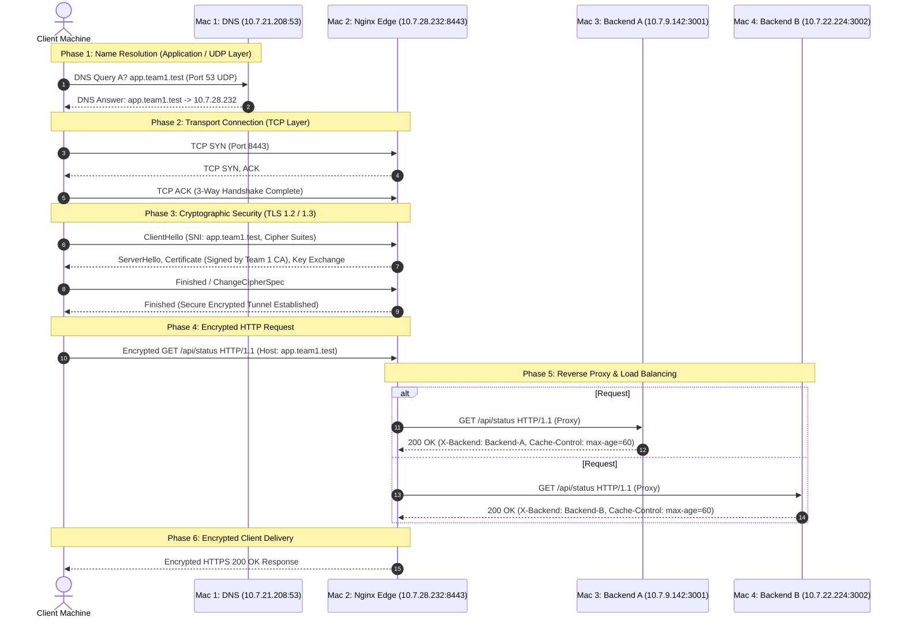

# End-to-End Request Flow Architecture

This document describes the exact sequence of network events that occur when a client machine on the private LAN accesses the service via domain name `https://app.team1.test:8443/`.

---

## 🔄 Step-by-Step Protocol Sequence

---

## 📌 Protocol & Port Mapping Details

1. **DNS Resolution (UDP Port 53)**:
   - Client sends a standard recursive DNS query for `app.team1.test` to Mac 1 (`10.7.21.208`).
   - `dnsmasq` responds authoritatively with `10.7.28.232` (Mac 2 Edge IP).

2. **TCP Three-Way Handshake (TCP Port 8443 / 8080)**:
   - Client initiates connection to `10.7.28.232:8443` with `[SYN]`.
   - Mac 2 responds with `[SYN, ACK]`.
   - Client acknowledges with `[ACK]`. Socket pair established: `(Client_IP:Ephemeral_Port, 10.7.28.232:8443)`.

3. **TLS Handshake (TLS 1.2 / TLS 1.3)**:
   - Client negotiates encryption using `ClientHello` containing Server Name Indication (SNI) `app.team1.test`.
   - Nginx presents the server certificate signed by Team 1 Local Root CA.
   - Client validates the certificate against its trusted keychain root, establishing an encrypted session without security warnings.

4. **HTTP Request & Nginx Reverse Proxy Forwarding**:
   - Client issues `GET /api/status` over the encrypted TLS session.
   - Nginx terminates TLS, inspects headers, and forwards the plain HTTP request to the `team1_backends` upstream pool using round-robin distribution:
     - First connection -> Mac 3 (`10.7.9.142:3001`)
     - Next connection -> Mac 4 (`10.7.22.224:3002`)

5. **Backend Processing & Response Header Attachment**:
   - Python HTTP server processes request and returns JSON body.
   - Server attaches `X-Backend: Backend-A` (or `Backend-B`) and `Cache-Control: max-age=60`.

6. **Response Delivery**:
   - Nginx receives backend response, wraps it in the encrypted TLS channel, and returns `HTTP/1.1 200 OK` to the client.
